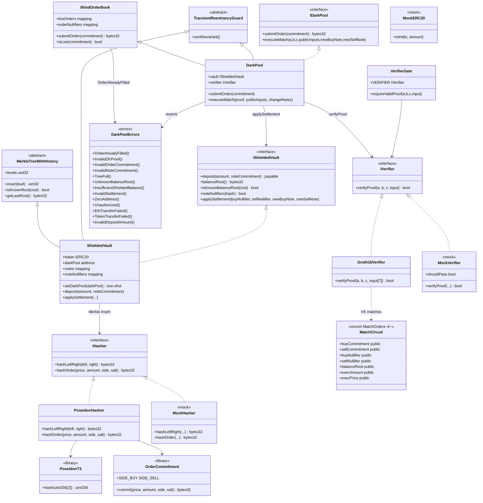

# Diagrama de clases — ZK Dark Pool & Blind Order Book

Vista estructural de contratos, circuitos, librerías e interfaces (módulo 21, **v1 cerrado**).  
**Sync:** 2026-09-15 · API = código · `forge test` → **74 PASS**.

## Diagrama (Mermaid)

---

## Relaciones clave

| Relación | Descripción |
|----------|-------------|
| Trader → Poseidon | `commitment = Poseidon(Poseidon(price,amount), Poseidon(side,salt))` off-chain |
| Trader → DarkPool | Solo publica el commitment; parámetros ocultos |
| DarkPool ⊃ BlindOrderBook | Órdenes vivas (`liveOrders`) + `orderNullifiers` |
| DarkPool → Verifier | Match solo con Groth16 válida (7 públicos) |
| DarkPool → ShieldedVault | `applySettlement` con nullifiers de nota + change notes |
| Vault → Hasher | Merkle Poseidon (`hashLeftRight`) en deposit / change notes |
| Circuito → Verifier | Públicos: commitments, nullifiers, root, execAmount, execPrice |

---

## Notas de diseño (v1)

- Órdenes **ciegas**: ningún `price`/`amount`/`side` on-chain hasta el match.
- Nullifiers: `orderNullifiers` + `OrderAlreadyFilled()`; notas vía `noteNullifiers`.
- Proof: BUY ≥ SELL, membership bajo `balanceRoot`, `execPrice` en rango.
- Settlement **proof-based** (sin EIP-712 en v1); solo `darkPool` llama `applySettlement`.
- Transient reentrancy **por contrato** (`tstore` xor `address()`): DarkPool → Vault en la misma tx.
- Stack: Solidity `0.8.24`, Foundry, Poseidon, Groth16/BN254. Frontend Next.js fuera de v1.
- Decisiones / e2e: [`diagrama-de-flujo.md`](./diagrama-de-flujo.md) · [`flujograma.md`](./flujograma.md).
