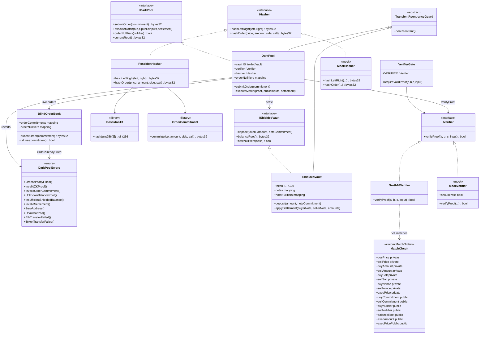

# Diagrama de clases — ZK Dark Pool & Blind Order Book

Vista estructural de contratos, circuitos, librerías e interfaces (módulo 21, **diseño objetivo v1**).  
**Sync:** 2026-09-15 · pre-implementación (autorización por fases).

## Diagrama (Mermaid)

---

## Relaciones clave

| Relación | Descripción |
|----------|-------------|
| Trader → Poseidon | `commitment = hash(price, amount, side, salt)` off-chain |
| Trader → DarkPool | Solo publica el commitment; parámetros ocultos |
| DarkPool → BlindOrderBook | Órdenes vivas indexadas por commitment |
| DarkPool → Verifier | Match solo con Groth16 válida (precio, saldos, rango) |
| DarkPool → orderNullifiers | Un nullifier = un fill (parcial o total) |
| DarkPool → ShieldedVault | Settlement atómico entre notas apantalladas |
| Circuito → Verifier | Públicos alineados: commitments, nullifiers, root, exec |

---

## Notas de diseño

- Órdenes **ciegas**: ningún `price`/`amount`/`side` on-chain hasta el match probado.
- Nullifiers obligatorios: `mapping(bytes32 => bool) public orderNullifiers` + `error OrderAlreadyFilled()`.
- Proof demuestra: BUY ≥ SELL, nonces/saldos válidos, `execPrice` dentro del rango comprometido.
- Settlement: transferencias entre vaults apantallados (EIP-712 o proof-based).
- Stack: Solidity `0.8.24`, Foundry, Poseidon, Groth16/BN254. Frontend Next.js fuera de v1.
- Diagramas de decisión/e2e: [`diagrama-de-flujo.md`](./diagrama-de-flujo.md) · [`flujograma.md`](./flujograma.md).
