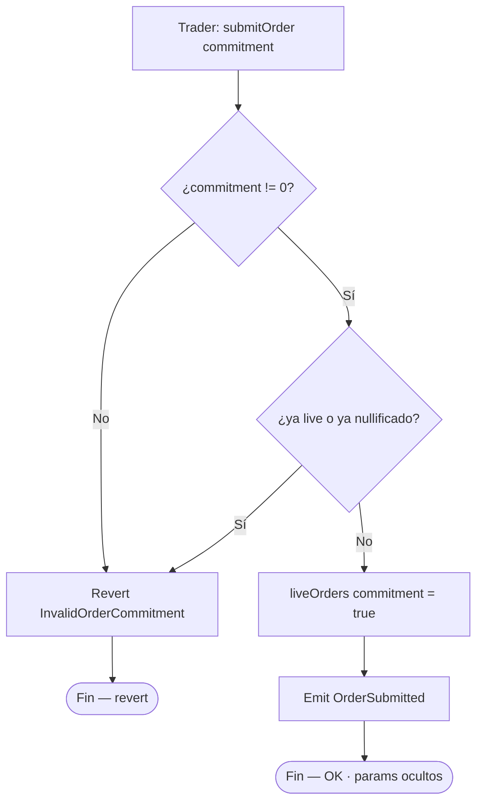
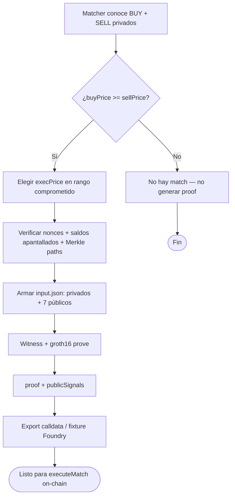
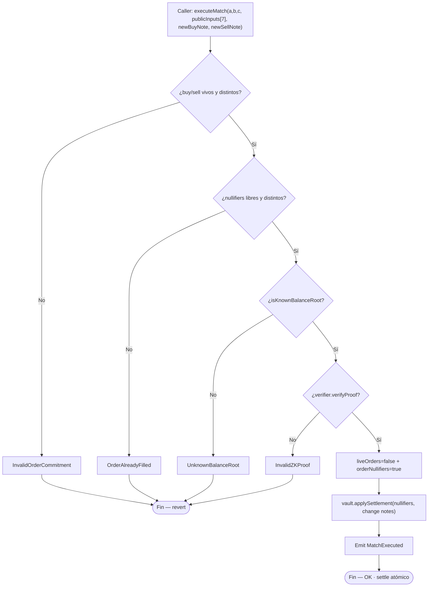
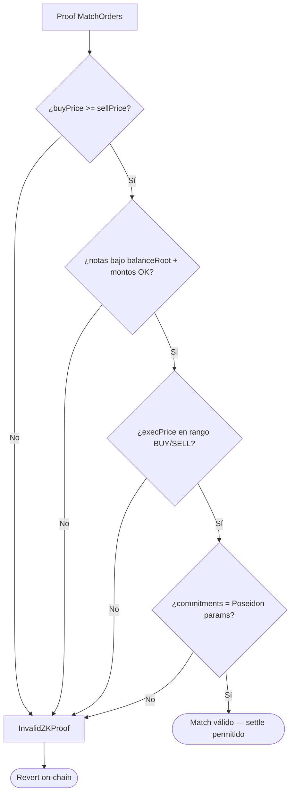
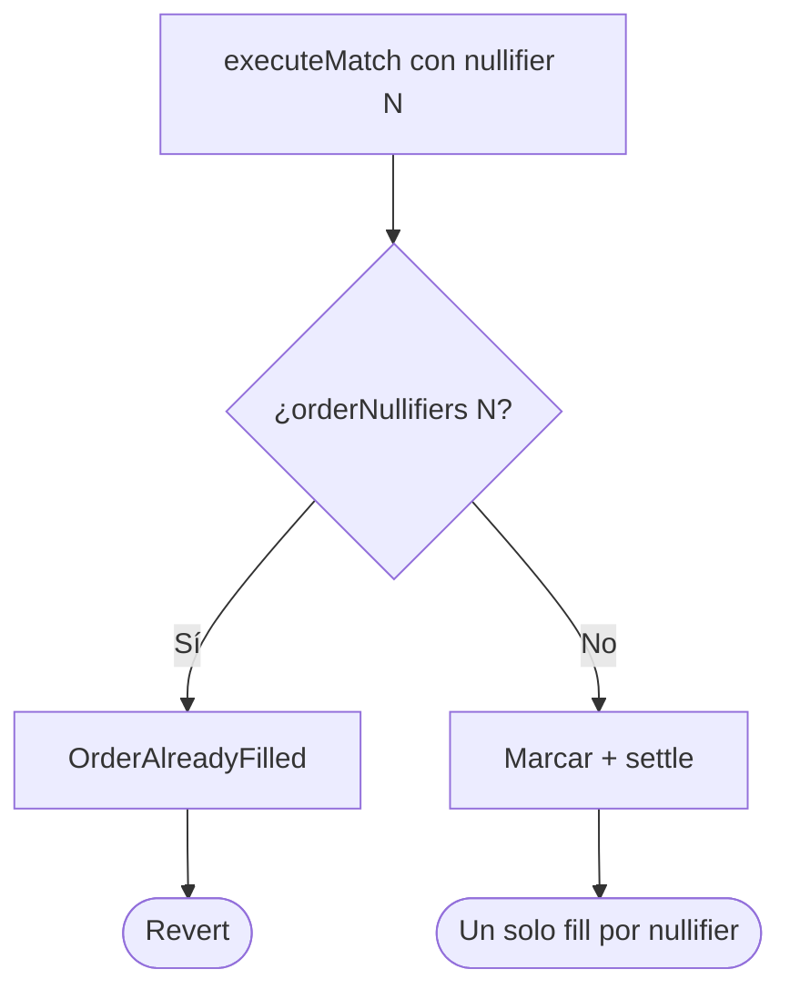
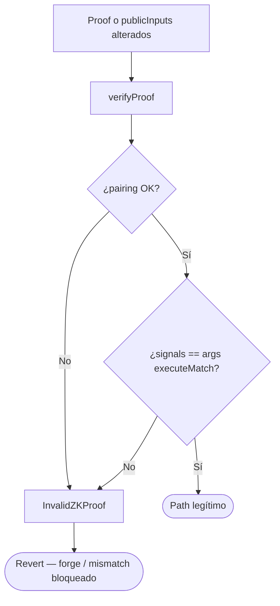
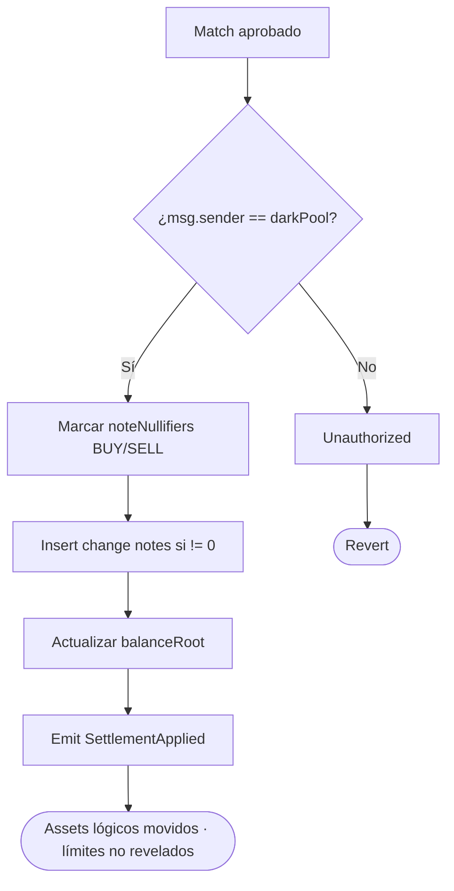

# Diagrama de flujo — Commit, match ZK y settlement

Flujos de decisión internos del dark pool, nullifiers y verificación ZK (módulo 21, **v1 cerrado**).  
**Sync:** 2026-09-15 · alineado a `DarkPool.executeMatch` / `ShieldedVault`.

## 1. submitOrder (commitment ciego)

> Off-chain: `commitment = Poseidon(Poseidon(price, amount), Poseidon(side, salt))`.

---

## 2. Generación de proof de match (off-chain — Circom / SnarkJS)

---

## 3. executeMatch (checks → proof → effects → settle)

> **CEI (Fase 7):** checks baratos → pairing → mark sin re-SLOAD → settle. Transient `nonReentrant` por contrato.

### Públicos (`publicInputs[7]`)

| Índice | Señal |
|--------|--------|
| 0–1 | `buyCommitment`, `sellCommitment` |
| 2–3 | `buyNullifier`, `sellNullifier` |
| 4 | `balanceRoot` |
| 5–6 | `execAmount`, `execPrice` |

---

## 4. Validación ZK del match (qué demuestra el proof)

---

## 5. Anti double-fill (nullifier de orden)

---

## 6. Proof inválida / tampered / price mismatch

---

## 7. Settlement apantallado (v1 proof-based)

> v1 **no** usa EIP-712 para payout; el binding lo da Groth16 + nullifiers.

---

## Relación con otros docs

- UML: [`diagrama-de-clases.md`](./diagrama-de-clases.md)
- E2E: [`flujograma.md`](./flujograma.md)
- Gas / SWC: [`GAS.md`](./GAS.md) · [`SWC-AUDIT.md`](./SWC-AUDIT.md)
- Índice: [`README.md`](./README.md)
