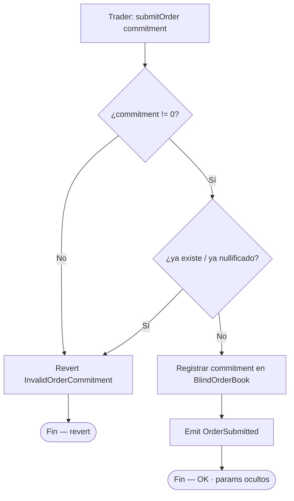
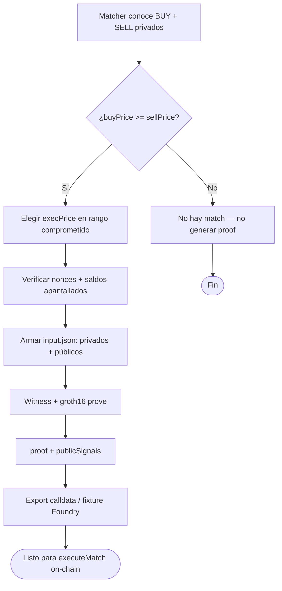
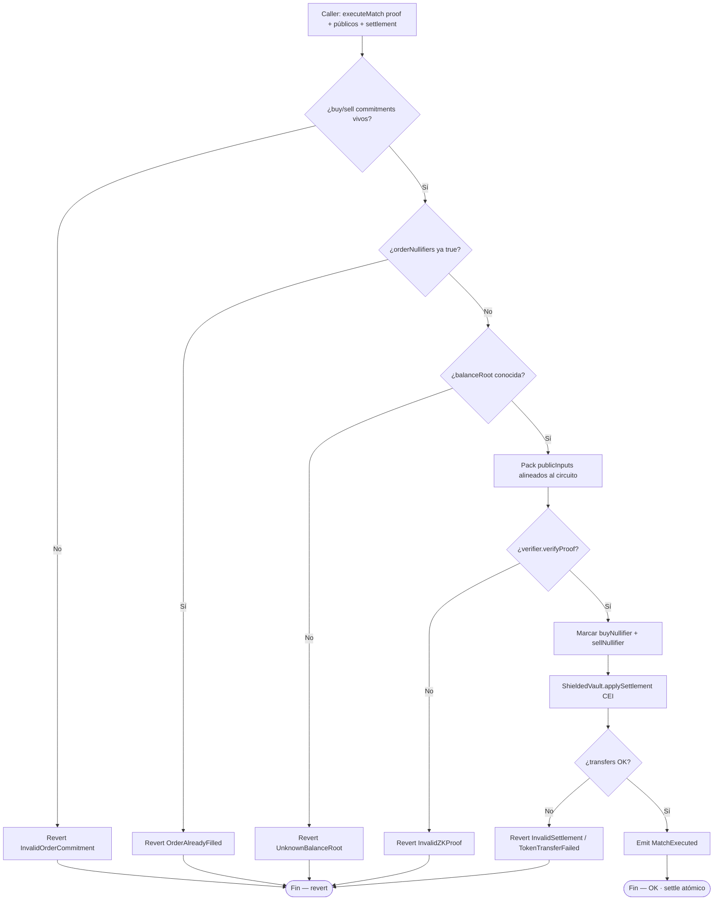
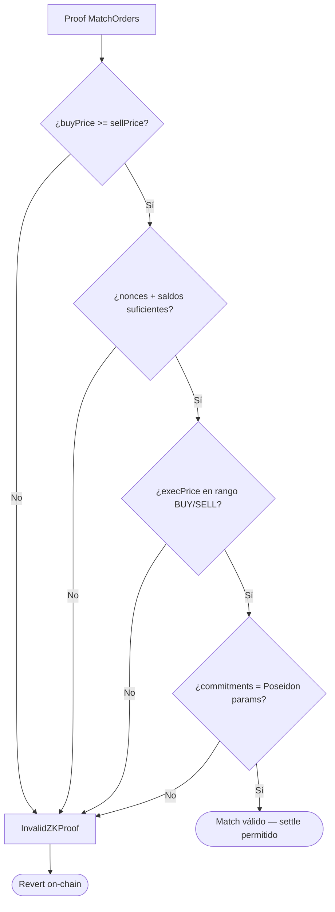
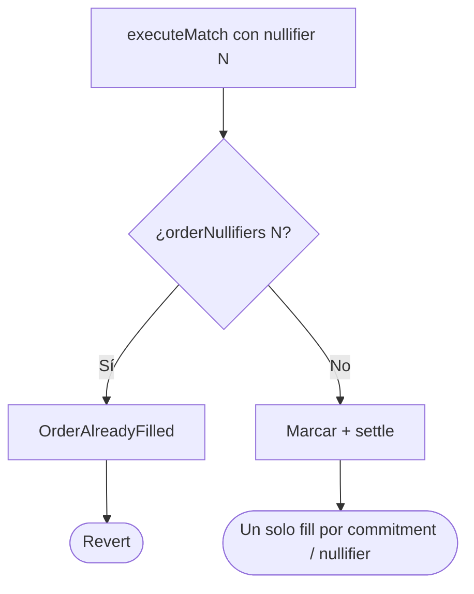
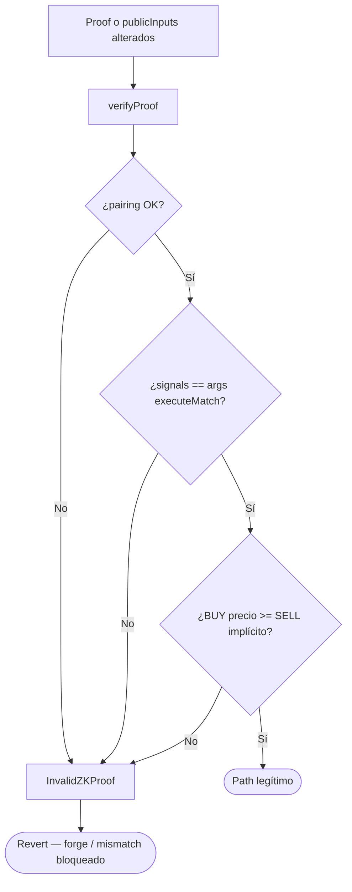
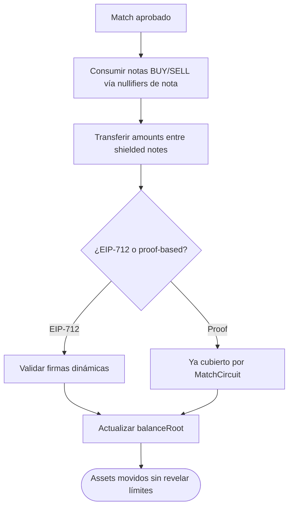

# Diagrama de flujo — Commit, match ZK y settlement

Flujos de decisión internos del dark pool, nullifiers y verificación ZK (módulo 21, **diseño objetivo v1**).  
**Sync:** 2026-09-15.

## 1. submitOrder (commitment ciego)

> `commitment = Poseidon(price, amount, side, salt)` off-chain. Sin exposición de trade params on-chain.

---

## 2. Generación de proof de match (off-chain — Circom / SnarkJS)

---

## 3. executeMatch (nullifiers → proof → settle)

> CEI: marcar `orderNullifiers` **antes** de tocar el vault. Transient reentrancy.

---

## 4. Validación ZK del match (qué demuestra el proof)

---

## 5. Anti double-fill (nullifier de orden)

---

## 6. Proof inválida / tampered / price mismatch

---

## 7. Settlement apantallado

---

## Relación con otros docs

- UML: [`diagrama-de-clases.md`](./diagrama-de-clases.md)
- E2E: [`flujograma.md`](./flujograma.md)
- Índice: [`README.md`](./README.md)
