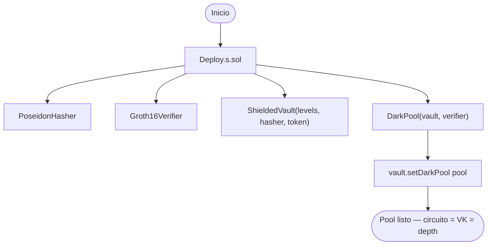
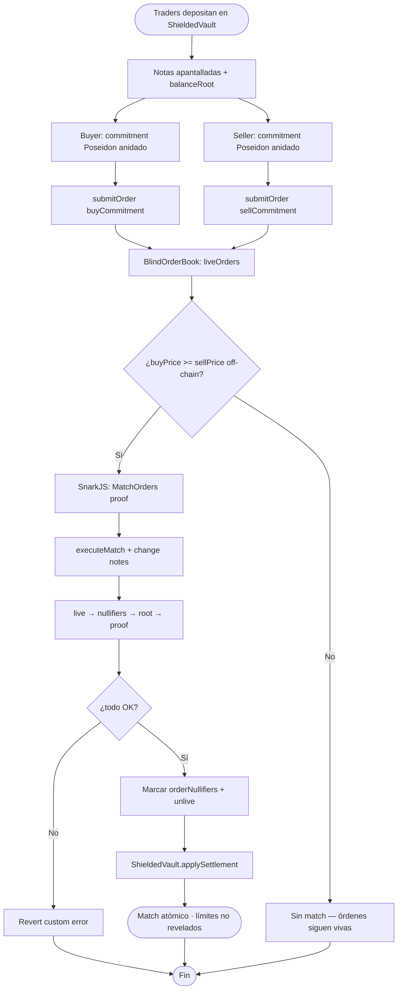
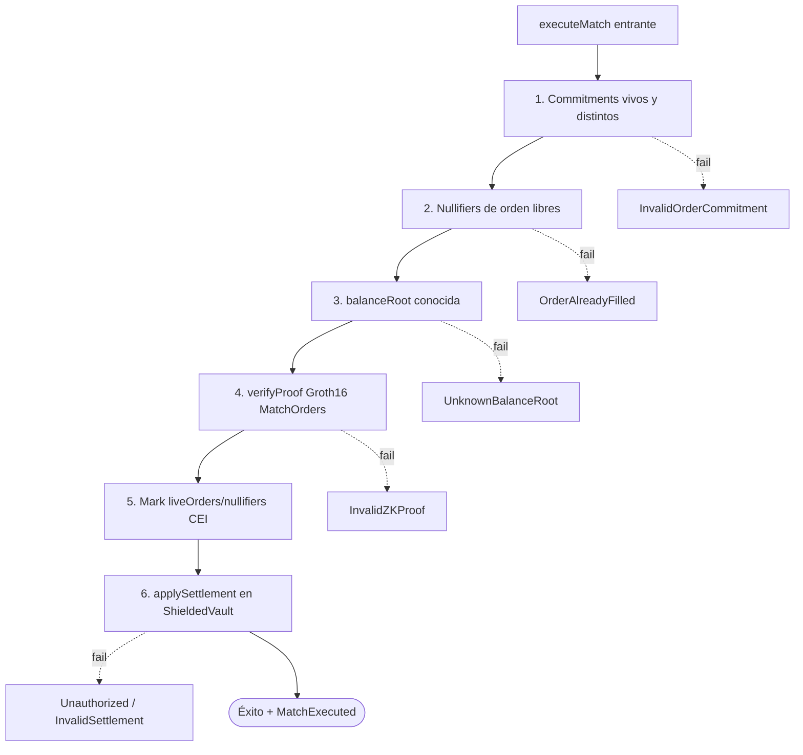
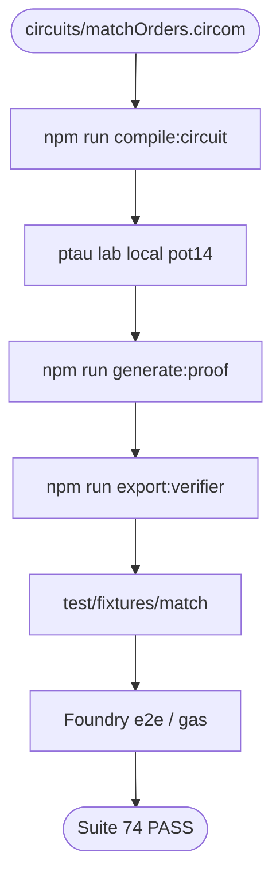
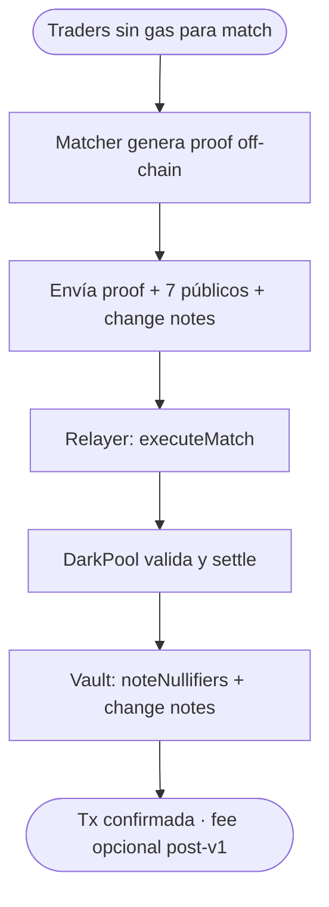

# Flujograma — Ciclo completo ZK Dark Pool

Flujo extremo a extremo entre traders, circuito, dark pool, verifier y vault apantallado (módulo 21, **v1 cerrado**).  
**Sync:** 2026-09-15 · **74 PASS**.

## Actores

| Actor | Rol |
|-------|-----|
| Buyer / Seller | Generan `(price, amount, side, salt)`, commitment Poseidon, depositan en vault |
| Matcher / Relayer | Construye witness de match, genera proof Groth16, llama `executeMatch` |
| DarkPool | Órdenes ciegas, nullifiers, verify, orquesta settlement |
| ShieldedVault | Notas apantalladas, roots de saldo, `applySettlement` |
| Groth16Verifier | Pairing BN254 / Alt_BN128 (`ecPairing` `0x08`) |
| Circom / SnarkJS | `MatchOrders(4)`, fixtures, export VK |
| Deployer | `Deploy.s.sol`: hasher + verifier + vault + pool + `setDarkPool` |
| CI / Foundry | Unit, fuzz, gas snapshot, e2e fixture |

---

## Flujograma — Deploy

> `MERKLE_TREE_LEVELS` debe coincidir con `MatchOrders(N)` y el verifier exportado.

---

## Flujograma principal — Deposit → Commit → Match → Settle

---

## Flujograma — Capas de defensa en executeMatch

---

## Flujograma — Toolchain circuito (lab)

---

## Flujograma — Match vía relayer

---

## Matriz de caminos felices / fallo

| Escenario | Resultado esperado |
|-----------|-------------------|
| `submitOrder` con commitment válido | Orden viva + `OrderSubmitted` |
| Match proof válida + BUY ≥ SELL | Settlement + nullifiers marcados |
| Mismo `orderNullifier` dos veces | `OrderAlreadyFilled` |
| Root de saldo desconocida | `UnknownBalanceRoot` |
| Proof / signals alterados | `InvalidZKProof` |
| Price mismatch (BUY < SELL) | No proof válida → `InvalidZKProof` |
| `applySettlement` sin ser darkPool | `Unauthorized` |
| Deposit con amount/msg.value inconsistente | `InvalidDepositAmount` |

---

## Relación con otros diagramas

- Estructura de tipos: [`diagrama-de-clases.md`](./diagrama-de-clases.md)
- Decisiones internas: [`diagrama-de-flujo.md`](./diagrama-de-flujo.md)
- Fases: [`planificacion.md`](./planificacion.md)
- Gas / SWC: [`GAS.md`](./GAS.md) · [`SWC-AUDIT.md`](./SWC-AUDIT.md)
- Índice: [`README.md`](./README.md)
